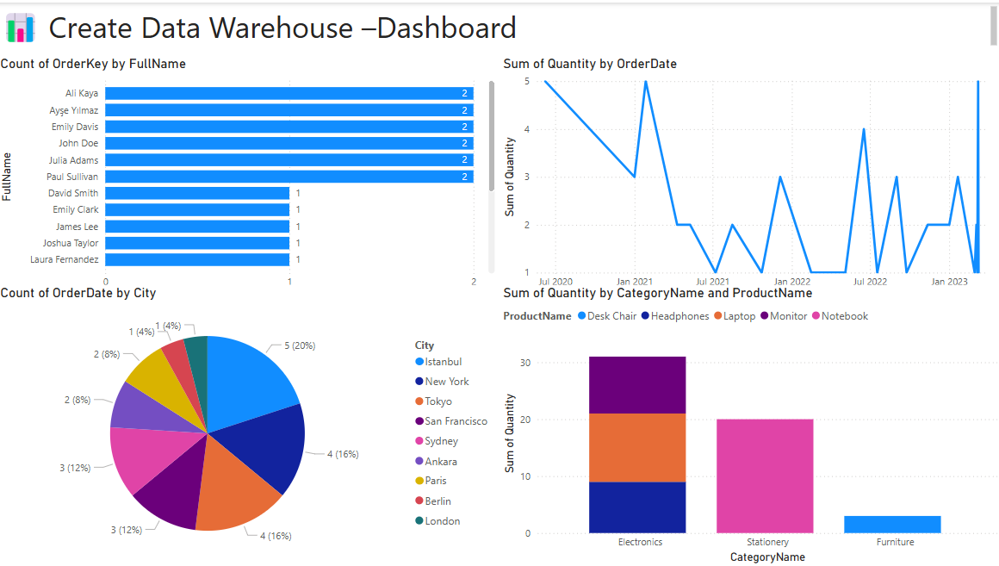

# 📦 Create Data Warehouse Project

This project is an end-to-end data engineering solution that extracts sales data through an ETL (Extract-Transform-Load) process, loads it into an MSSQL data warehouse modeled using a dimensional (Kimball) architecture, and visualizes it with Power BI.

---

## 🛠️ Technologies Used

- **Python** (`pandas`, `pyodbc`, `dotenv`) – ETL operations  
- **MSSQL** – Data warehouse platform  
- **Kimball Model** – Dimensional data modeling  
- **Power BI** – Data visualization  
- **VS Code** – Development environment

---

## 🧱 Project Structure

- `create-datawarehouse/`
- `├── seed_data/` – Realistic CSV datasets  
- `│   ├── customers.csv`  
- `│   ├── products.csv`  
- `│   └── orders.csv`  
- `├── etl_pipeline.py` – Handles MSSQL connection, data load, and error logging  
- `├── schema.sql` – Data warehouse schema (Dim and Fact tables)  
- `├── procedures.py` – Simulated stored procedures  
- `├── analysis_queries.sql` – OLAP-style queries (slicer, filter, trend)  
- `├── test_pipeline.py` – ETL test and data validation  
- `├── etl_errors.log` – Logs data quality issues  
- `├── .env` – MSSQL connection credentials  
- `├── requirements.txt` – Python dependencies  
- `└── README.md`

---

## 🧮 Data Warehouse Model (Kimball Approach)

| Fact Table | Dimension Tables |
|------------|------------------|
| FactOrder  | DimCustomer, DimProduct, DimCategory, DimDate |

---

## ⚙️ ETL Workflow

- MSSQL connection is established using credentials from `.env`
- Run `etl_pipeline.py` with Python
- CSV datasets are loaded into:
  - **DimCustomer**
  - **DimCategory & DimProduct**
  - **FactOrder**
- Data quality issues are logged into `etl_errors.log`
- ETL tests and validation are run using `test_pipeline.py`

---

## 📊 Power BI Dashboard – Sales Analysis

The dashboard below visualizes the post-ETL data warehouse model using Power BI.

### 📸 Dashboard Preview

### 📈 Visuals Included:
- **Bar Chart** → Top ordering customers  
- **Pie Chart** → Order distribution by city  
- **Line Chart** → Monthly order trend  
- **Stacked Column Chart** → Sales by product category

